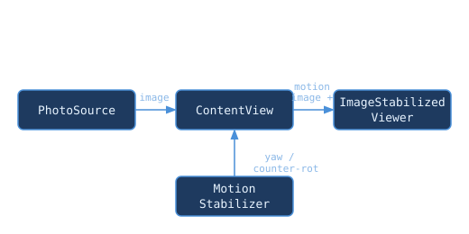

# StayStill

StayStill is an *artistic experiment*: an iOS app for real-world photo stabilisation.
This project is provided as is, without warranty.

## Usage

1. Launch the app on an iOS device or simulator.
2. Tap "Pick Photos" to select images from your library.
3. Rotate your device to see stabilization effects.
4. Pinch to zoom.
5. Single-tap to open the overlay with image loading controls.
6. Tap "Load New Image" to replace the currently displayed image.

## Build

Open `StayStill/StayStill.xcodeproj` in Xcode and run on an iOS device or simulator.

## Architecture

Read [STATUS.md](STATUS.md) for more implementation details.

## License

MIT: [LICENSE.md](LICENSE.md)

## Disclaimer

All this is 'AS IS'.

